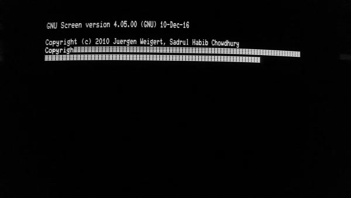
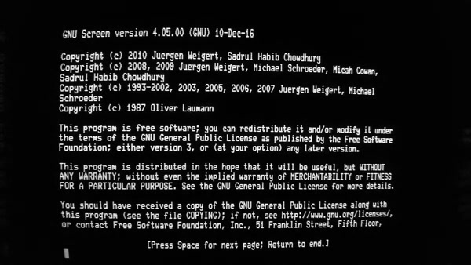

HUPMon
======

HUPMon is a tool created to detect terminal hangups on configurations where it
is not possible and/or practical to detect disconnects using hardware (e.g.
DTR, CTS, etc.). It does this by transmitting an ANSI escape sequence
requesting a Cursor Position Report (CPR). If HUPMon receives a response, the
terminal is considered online, but if there was no response, the terminal is
considered offline and a hangup signal is sent to the COMMAND. When using
one-shot mode, there are three strings that HUPMon may print:
"DEVICE_STATUS_UNKNOWN", if there was an error while attempting to query the
terminal; "DEVICE_ONLINE", if there was a response to the query; and
"DEVICE_OFFLINE" if there was no response.

HUPMon was developed for use with a DEC VT101 terminal owned by the author. The
VT101 only supports software-based flow control using XON and XOFF control
characters. With flow control disabled, the terminal quickly gets overloaded at
any transmission speed above 2400 baud turning the screen into a garbled mess,
so HUPMon was designed with support for software flow control. By using "-f",
hangup detection can be disabled, and HUPMon will act as a flow control-aware
proxy for programs that have no XON/XOFF support (i.e. tmux) or poor support
(i.e. GNU Screen).

Here's what happens when loading GNU Screen on a VT101:

Here's what happens when loading GNU Screen on a VT101 under `hupmon -f`:

Currently only Linux is supported, but support for macOS, FreeBSD and OpenBSD
will be considered in the future.

Building
--------

If Make is installed, running `make` will build an executable named "hupmon".
The default CC and CFLAGS variables are defined for Clang/LLVM; adjust them
accordingly or uncomment out the alternative definitions.

Usage
-----

`hupmon [-1fh] [-r SECONDS] [-t SECONDS] [COMMAND [ARGUMENT]...]`

`hupmon --help`

### Options (and Defaults) ###

#### -1 ####

One-shot mode; immediately query the terminal to determine if it is online and
print the status to standard output. It is an error to specify a command when
using this mode.

#### -f ####

Enable flow-control-only mode. When this option is used, the terminal will
never be queried to check if it is online, and HUPMon just acts as proxy
between hardware that depends on software flow control and programs that either
have poor implementations or none at all.

#### -h ####

Hangup monitoring mode; run a command and periodically query the terminal to
see if it is still online. If the terminal is offline, the subprocess will be
sent a SIGHUP.

#### -r _SECONDS_ ("0.200") ####

Reply timeout in seconds; this is the total amount of time HUPMon will wait for
a reply from the terminal after submitting a query. If flow control is enabled
and the terminal responds with XOFF to temporarily suspend transmission, the
deadline will be extended by 100 milliseconds. This value must be at least 10
milliseconds (0.01). If HUPMon reports that a terminal is offline when it is
not, it may not be responding to the query fast enough, and increasing this
value may resolve the issue.

#### -t _SECONDS_ ("10") ####

This is the threshold of terminal inactivity in seconds before a query is sent.
If the terminal is not offline, HUPMon will wait the same amount of time before
submitting another query. This value must be at least 1 second.

Environment Variables
---------------------

- HUPMON_PID: Set to HUPMon's PID.
- HUPMON_TTY: Set to the path of HUPMon's controlling terminal.

Examples
--------

- Act as a flow control agent between GNU Screen and a terminal:

      $ hupmon -f screen

- Start a Bash login shell. The terminal will be polled after 60 seconds of
  inactivity, and Bash will be sent a SIGHUP if the terminal appears to be
  offline:

      $ exec hupmon -t 60 bash -l
